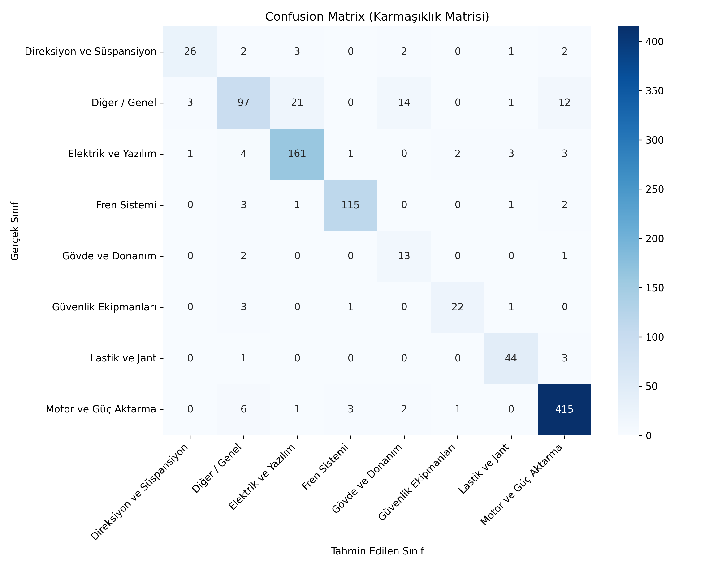
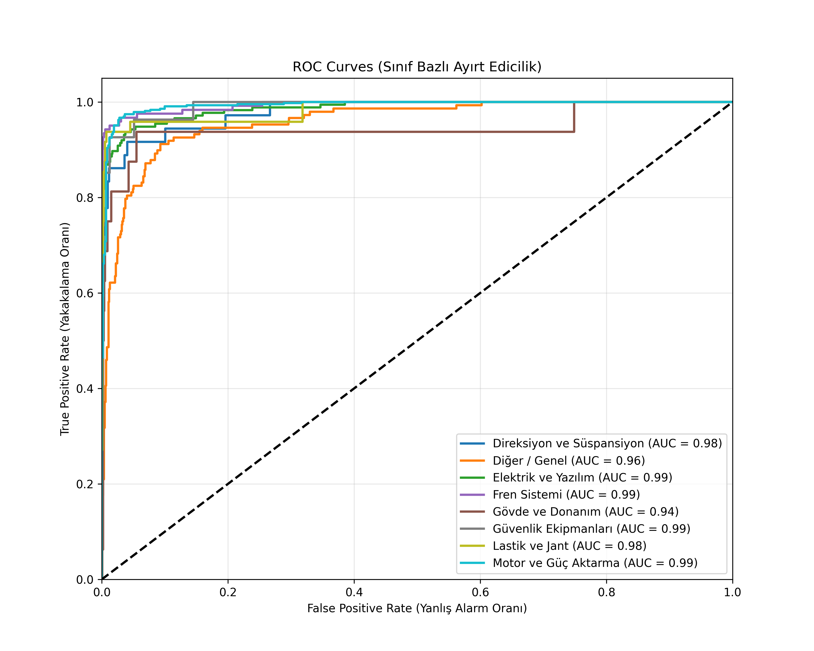

# 🚗 BERT-Tabanlı Otomotiv Kök Neden Analizi ve Arıza Teşhis Sistemi

**Proje Ne Yapıyor?**
* **Akıllı Metin Sınıflandırma:** Araç sahipleri tarafından iletilen, teknik jargon içeren veya içermeyen serbest metin formatındaki şikayetleri anında analiz eder.
* **Otonom Kök Neden Tespiti (RCA):** Sadece anahtar kelime eşleşmesi değil, metnin derin anlamsal (semantik) yapısını kullanarak arızayı 8 farklı teknik kategoriye (Motor, Fren, Yazılım vb.) %90.6 doğrulukla atar.
* **Operasyonel Optimizasyon:** Servis süreçlerindeki "yanlış birime yönlendirme" hatalarını minimize ederek, teknik darboğazların (bottlenecks) oluşmasını engeller.

### 📊 Veri Kaynağı ve Entegrasyonu
Sistem, gücünü gerçek dünya verilerinden ve resmi kayıtlardan alır:
* **Veri Seti:** Bu çalışmada kullanılan veriler, ABD Ulaştırma Bakanlığı'na bağlı **NHTSA (National Highway Traffic Safety Administration)** resmi veri setlerinden derlenmiştir.
* **Kapsam:** [NHTSA Datasets & APIs](https://www.nhtsa.gov/nhtsa-datasets-and-apis) üzerinden erişilen gerçek araç geri çağırma (recall) ve güvenlik şikayetleri, modelin eğitimi için "Gold Standard" veri kaynağı olarak kullanılmıştır.
* **Yerelleştirme:** Orijinal veriler, otomotiv terminolojisine sadık kalınarak Türkçe dil yapısına adapte edilmiş ve 5.000+ satırlık bir "Teknik Şikayet Deposu" oluşturulmuştur.

### 🛠️ Kullandığım Teknolojiler
* **BERT (dbmdz/bert-base-turkish-cased):** Türkçe dil yapısı için optimize edilmiş, bağlam duyarlı en gelişmiş NLP modeli.
* **Python & HuggingFace:** Model ince ayarı (fine-tuning) ve çıkarım (inference) süreçlerinin yönetimi.
* **PyTorch:** Yüksek performanslı derin öğrenme hesaplamaları ve GPU hızlandırma.
* **Scikit-Learn:** Precision, Recall ve F1-Score analizleri ile model başarısının matematiksel doğrulaması.

### 🚀 Nasıl Çalıştırırsınız?
Proje, büyük bir model dosyası (`.safetensors`) içerdiği için Git LFS yüklü olmalıdır:
1.  **Repoyu Klonlayın:** `git clone https://github.com/sevgiakyuz/BERT-tabanli-otomotiv-kok-neden-siniflandirma.git`
2.  **Ortamı Hazırlayın:** `pip install -r requirements.txt`
3.  **Tahmin Yapın:** `notebooks/Demo.ipynb` dosyasını açarak hazır modellerle kendi şikayet metinlerinizi test edebilirsiniz.

### 📈 Akademik Başarı Metrikleri
Modelin başarısı, akademik standartlarda (Confusion Matrix ve ROC-AUC) valide edilmiştir:

| Performans Göstergesi | Değer |
| :--- | :--- |
| **Doğruluk (Accuracy)** | %90.60 |
| **F1-Skoru (Weighted)** | 0.9070 |
| **Veri Kaynağı** | NHTSA Safety Data |

  
  

### 🔗 Referanslar
Bu çalışma, yapılandırılmamış teknik metinlerin anlamlandırılması üzerine aşağıdaki akademik yaklaşımlardan esinlenmiştir:
* **Veri Sağlayıcı:** National Highway Traffic Safety Administration (NHTSA).
* **Metodolojik Referans:** *Nagaiah, B. (2024). Measurement and Effects of Supply Chain Bottlenecks Using Natural Language Processing.* (Nature Scientific Data standartlarına uygunluk).

---
**Geliştirici:** [Sevgi Akyüz](https://github.com/sevgiakyuz)
**Lisans:** Akademik Kullanım (MIT)
